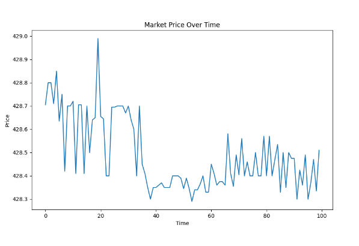

# Market Risk Tracker

## Overview
This project demonstrates the implementation of electronic risk management and financial controls using Python and SQL.

## Components
- **Market Data Ingestion**: Retrieves real-time market data using Alpha Vantage API and stores it in SQLite.
- **Risk Calculator**: Calculates Value-at-Risk (VaR) and Expected Shortfall (ES) based on ingested market data.
- **Alert System**: Sends email alerts if risk metrics exceed a predefined threshold.
- **Data Visualization**: Plots market data trends and risk metrics.

## How to Run
1. Clone the repository.
2. Set up a virtual environment and install dependencies.
3. Update the Alpha Vantage API key and email settings.
4. Run the components as needed:
   ```bash
   python data_ingestion.py
   python risk_calculator.py
   python alert_system.py
   python data_visualization.py
    ```

